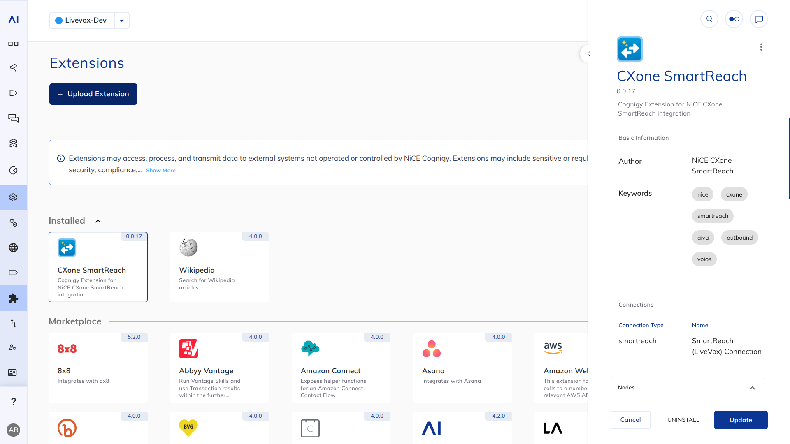
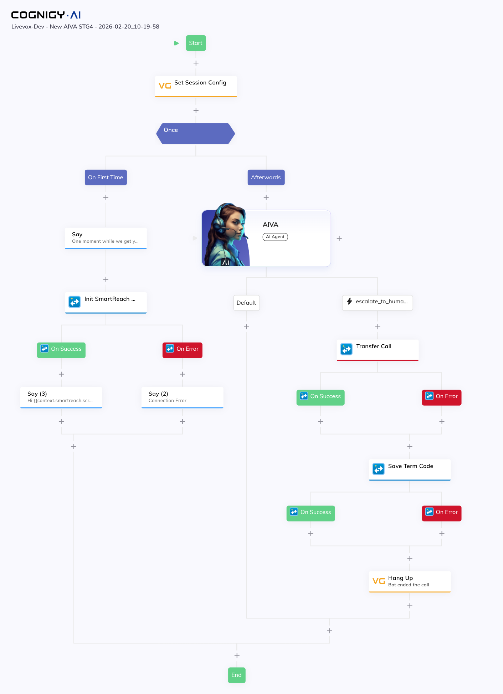

# CXone SmartReach Extension - Technical Guide

## Installation

Download the latest build: [cxone-smartreach.tar.gz](https://github.com/nice-cxone/cxone-smartreach-cognigy-extension/tree/0.1.0/cxone-smartreach.tar.gz)

Upload the extension to your Cognigy.AI instance through the Extensions Marketplace.



## SIP Headers

LiveVox sends the following SIP headers with each call:

| Header | Example Value | Description |
|--------|---------------|-------------|
| `X-agent-login-id` | `AIVA5` | Virtual agent login ID |
| `X-transaction-id` | `147516594361` | Unique call transaction ID |
| `Session-ID` | `UF200T64DE3A63@10.XX.21.XX` | SIP session identifier |
| `DNIS` | `899` | Dialed number |

These are automatically parsed by the **Init SmartReach Context** node.

---

## API Reference

### Session API (Login)
- **Endpoint**: `POST /session/login`
- **Headers**: `LV-Access: <token>`
- **Body**: `{ clientName, userName, password, agent: true }`
- **Response**: `{ sessionId: "..." }`
- **Session Expiration**: 2-hour rolling window (renewed on each API call)
- **Documentation**: https://docs.livevox.com/dp/ra/fall24/session-api-169019707.html

### Screen Pop API
- **Endpoint**: `GET /callControl/agent/screenpop`
- **Headers**: `LV-Session: <sessionId>`
- **Response**: `{ screenPopRow: [{ key: "...", value: "..." }] }`
- **Documentation**: https://docs.livevox.com/dp/ra/latest/agent-api-methods-133268568.html

### Get Term Code API
- **Endpoint**: `GET /callControl/agent/termCode?serviceId={id}`
- **Headers**: `LV-Session: <sessionId>`
- **Response**: Array of term codes

### Save Term Code API
- **Endpoint**: `PUT /callControl/agent/call/termCode`
- **Headers**: `LV-Session: <sessionId>`
- **Body**: `{ callTransactionId, callSessionId, termCodeId, ... }`
- **Response**: `204 No Content` on success
- **Documentation**: https://docs.livevox.com/dp/ra/latest/agent-api-methods-162466702.html

### DocDb API
- **Endpoint**: `POST https://wrapper-prd.livevox.tools/reports/aiva2/`
- **Headers**: `GET-TOKEN: <token>`
- **Body**: Conversation details with ANI, DNIS, intents, etc.

---

## Session Token Management

The extension implements session token caching:

- **Caching**: 2-hour validity period matching LiveVox session expiration
- **Reuse**: Multiple logins with same credentials return same sessionId
- **Automatic Refresh**: Re-authenticates when cached token expires

This minimizes API calls and improves performance while maintaining security.

---

## Node Details

Example Flow:




### 1. Init SmartReach Context

**Purpose**: Initialize the SmartReach call context by parsing SIP headers, authenticating with LiveVox, and retrieving screen pop customer data.

**What it does**:
- Parses SIP headers: `X-agent-login-id`, `X-transaction-id`, `Session-ID`, `DNIS`
- Authenticates with LiveVox Session API to get `LV-Session` token
- Calls Screen Pop API to retrieve customer information
- Stores all data in context for use by other nodes

**Configuration**:
- **SmartReach Connection**: Connection credentials for LiveVox API
- **Fallback Agent Login ID**: Agent ID to use if SIP header missing

**Output Example**:
```json
{
  "agentLoginId": "AIVA5",
  "transactionId": "147516594361",
  "sessionId": "UF200T64DE3A63@10.XX.21.XX",
  "dnis": "899",
  "lvSessionToken": "***************************",
  "screenPop": {
    "firstName": "John",
    "lastName": "Doe",
    "accountNumber": "12345",
    "phoneDialed": "9174645253",
    "callDirection": "Inbound",
    "classification": "English",
    "callSkillName": "Customer Service"
  },
  "initialized": true,
  "timestamp": "2024-01-01T00:00:00.000Z"
}
```

**Child Nodes**:
- **On Success**: Executed when initialization succeeds
- **On Error**: Executed when initialization fails

---

### 2. Save Term Code

**Purpose**: Save a disposition/term code for the current call when it completes or escalates to a live agent.

**What it does**:
- Calls LiveVox Save Term Code API
- Uses call data from SmartReach context (transaction ID, session ID, session token)
- Supports optional fields like payment amount, account number, etc.
- Can set agent to "Not Ready" state after saving

**Configuration**:
- **SmartReach Connection**: Connection credentials
- **Use Context Data**: Auto-populate from Init Context node (recommended)
- **Context Key**: Where to find SmartReach data (default: `smartreach`)
- **Term Code ID**: The term code ID to save (required)
- **Phone Dialed**: Customer phone number
- **Move Agent to Not Ready**: Set agent state after call
- **Account Number**: Customer account (optional)
- **Payment Amount**: Payment made during call (optional)
- **Agent Entered Account**: Account entered by agent (optional)

**Usage**:
1. Run **Init SmartReach Context** node first to authenticate and store call data
2. Use **Save Term Code** when:
   - Call completes successfully (use completion term code)
   - Escalating to live agent (use escalation term code)
   - Any other disposition scenario

**Child Nodes**:
- **On Success**: Executed when term code saved successfully
- **On Error**: Executed when save fails

---

### 3. Get Term Codes

**Purpose**: Retrieve the list of available term codes for a service.

**What it does**:
- Calls LiveVox Get Term Code API
- Returns list of term codes with IDs and descriptions
- Store results for later selection/use

**Configuration**:
- **SmartReach Connection**: Connection credentials
- **Service ID**: The service to get term codes for (required)
- **SmartReach Context Key**: Where to find session token (default: `smartreach`)
- **Where to store the result**: Context or Input
- **Store Key**: Key to store term codes under (default: `smartreach_termcodes`)

**Usage**:
Use this node to dynamically discover available term codes for your service. Store the results and reference the appropriate `termCodeId` when calling Save Term Code.

---

### 4. DocDb Reporter

**Purpose**: Send conversation details back to LiveVox DocDb API for reporting and analytics.

**What it does**:
- Posts conversation metadata to LiveVox wrapper endpoint
- Includes intents, authentication status, payment info, escalation reasons
- Required for LiveVox reporting and agent desktop lookups

**Configuration**:
- **Use Context Data**: Auto-populate from SmartReach context
- **DocDb Endpoint URL**: Full URL to DocDb wrapper (default: production endpoint)
- **DocDb Token**: GET-TOKEN value for authentication
- **ANI**: Customer phone number (required)
- **DNIS**: Dialed number (required)
- **Account Number**: Customer account

**Usage**:
Call this node at the end of the conversation to send all conversation details back to LiveVox for reporting purposes.

---

### 5. SmartReach API Caller

**Purpose**: Make generic authenticated API calls to any LiveVox SmartReach endpoint.

**What it does**:
- Flexible HTTP client for LiveVox APIs
- Automatically includes authentication (LV-Session header)
- Supports all HTTP methods (GET, POST, PUT, DELETE, PATCH)
- Custom headers and body support

**Configuration**:
- **SmartReach Connection**: Connection credentials
- **HTTP Method**: GET, POST, PUT, DELETE, or PATCH
- **API Endpoint**: Full endpoint path (e.g., `/callControl/agent/status`)
- **Additional Headers**: Custom headers in JSON format
- **Request Body**: Request body for POST/PUT/PATCH in JSON format
- **SmartReach Context Key**: Where to find session token (default: `smartreach`)
- **Where to store the result**: Context or Input
- **Store Key**: Key to store response under

**Usage**:
Use this node to access any LiveVox API endpoint not covered by specific nodes. The session token is automatically included from the SmartReach context.

---

### 6. Transfer Call

**Purpose**: Transfer the current call to a supervisor or another number.

**What it does**:
- Calls LiveVox Transfer Call API to manually conference a supervisor
- Optionally puts the call on hold during transfer
- Supports secure transfer mode

**Configuration**:
- **SmartReach Connection**: Connection credentials
- **Supervisor Number**: Phone number to transfer the call to (required)
- **Put Call On Hold**: Toggle to put the call on hold during transfer (default: enabled)
- **Secure Transfer**: Toggle to enable secure transfer mode (default: disabled)
- **SmartReach Context Key**: Where to find session data (default: `smartreach`)

**Usage**:
Use this node when you need to transfer the call to a supervisor or another extension while the AI conversation is in progress.

---

## Connection Setup

Create a **SmartReach Connection** with the following fields:

| Field | Description | Example |
|-------|-------------|---------|
| **Access Token** | LV-Access header value | `your-access-token-here` |
| **Client Name** | LiveVox client name | `Integration_Services` |
| **Agent Password** | Shared password for virtual agents | `your-agent-password` |
| **Base URL** | LiveVox API base URL | `https://api.livevox.com` or `https://api.stg4.livevox.com` |

### Environments

- **Production**: `https://api.livevox.com`
- **Staging**: `https://api.stg4.livevox.com`

---

## Error Handling

### Init Context Node
- If SIP headers are missing, uses fallback agent login ID
- If screen pop fails, logs warning but continues with empty data
- Stores error information in context for debugging

### Save Term Code Node
- Validates required fields (transaction ID, session ID, term code ID)
- Provides clear error messages if context data is missing
- Stores error information for troubleshooting

### General
- All nodes log detailed error messages to Cognigy logs
- Failed API calls throw errors that can be caught with error handlers
- Non-critical failures (like screen pop) allow flow to continue

---

## Troubleshooting

### "Session token not found in context"
- **Cause**: Init Context node not run or failed
- **Solution**: Ensure Init Context executes successfully before other nodes

### "Transaction ID or Session ID missing"
- **Cause**: SIP headers not available or incorrectly parsed
- **Solution**: Check that call is coming from LiveVox with proper SIP headers

### "Failed to authenticate with LiveVox"
- **Cause**: Invalid credentials or network issues
- **Solution**: Verify connection settings (access token, client name, password, base URL)

### Screen Pop returns empty data
- **Cause**: No customer data available for call or API permissions issue
- **Solution**: This is non-critical; flow continues with empty screen pop data

### Term code save fails
- **Cause**: Invalid term code ID or missing required fields
- **Solution**: Use Get Term Codes node to verify valid term code IDs for your service

---

## Best Practices

1. **Always run Init Context first**: This node sets up all required authentication and call data
2. **Use context storage**: Store SmartReach data in context for easy access by all nodes
3. **Handle errors gracefully**: Use child nodes (On Success/On Error) to handle different outcomes
4. **Cache session tokens**: The extension automatically caches tokens, no manual intervention needed
5. **Different term codes for scenarios**: Use different term code IDs for:
   - Call completed successfully
   - Escalation to agent
   - Customer hung up
   - Technical issues
   - Other business-specific outcomes
6. **DocDb reporting**: Call DocDb Reporter at conversation end for complete reporting
